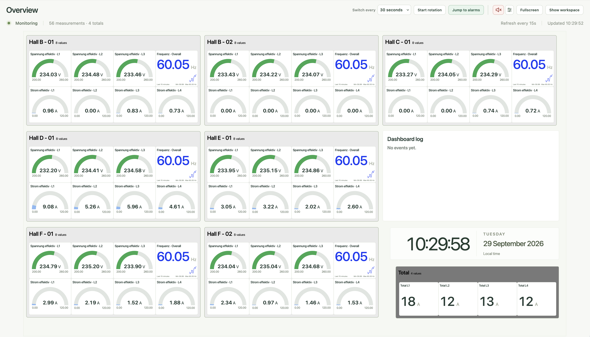
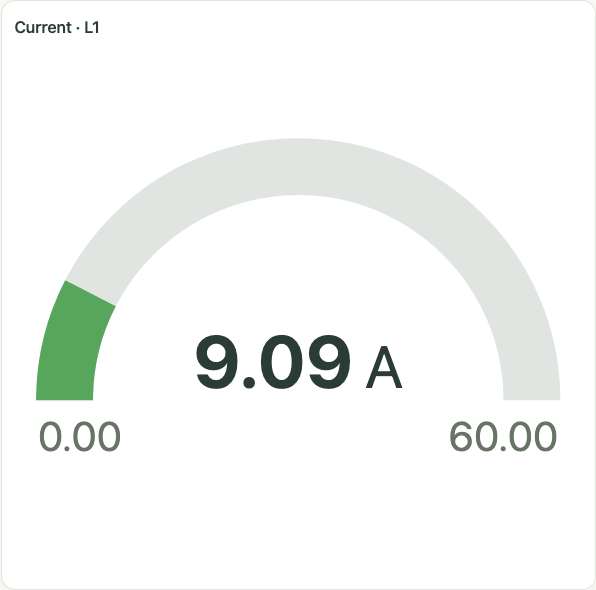
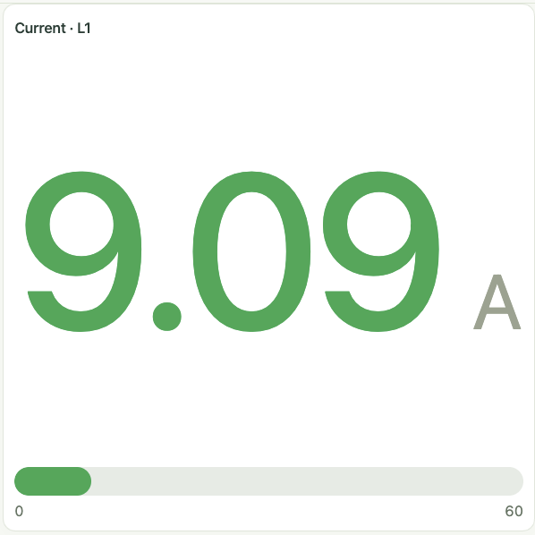
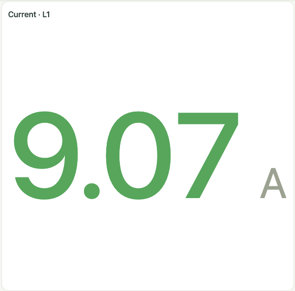
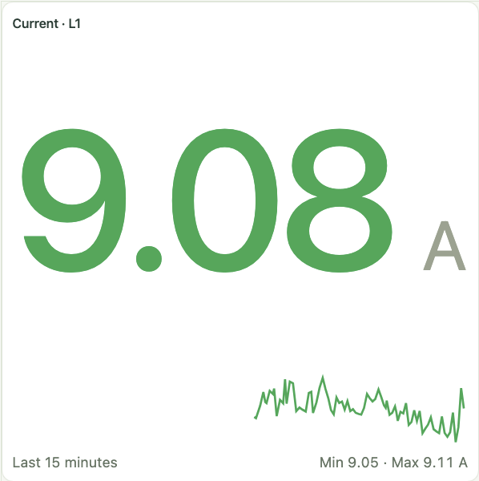
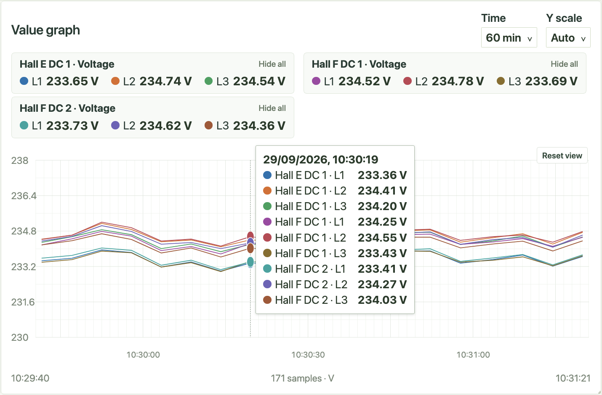
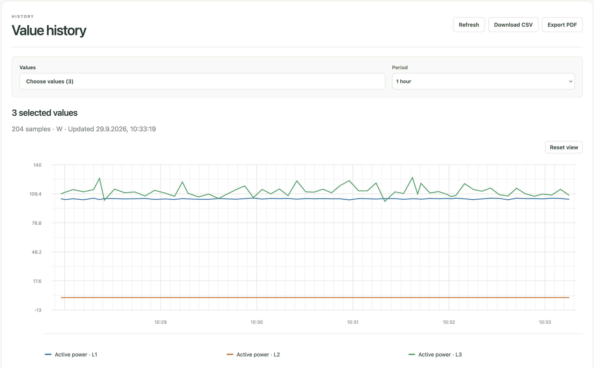

#  PhasePanel

[](https://github.com/mme89/PhasePanel/releases/latest)
[](https://github.com/mme89/PhasePanel)
[](https://github.com/mme89/PhasePanel)

PhasePanel is a local dashboard for live [Janitza](https://www.janitza.com/) measurements. Connect it to GridVis through its REST API or directly to devices over Modbus/TCP, then build dashboards in your browser. Each desktop download includes the server and Node.js runtime. The dashboard opens in your default browser.

## Screenshots

### Dashboard overview



### Measurement tiles

| Gauge | Bar | Value | Sparkline |
| --- | --- | --- | --- |
|  |  |  |  |

### Graph and history





## Features

- Create dashboards with movable, resizable measurement tiles and groups.
- Show readings as values, gauges, bars, status indicators, sparklines, and graphs; add text, date and time, consumption, and total tiles.
- Set value ranges and display alarms, with optional sound and notifications.
- Collect local value history and view or export reports. Direct Modbus/TCP connections can also show device and event history when supported and configured.
- Rotate dashboards for a wall display and use fullscreen mode.
- Export and import dashboard layouts as JSON files.

## Requirements

You need a reachable GridVis REST service or Janitza devices accessible over Modbus/TCP, plus a modern browser. The desktop downloads include Node.js. Running from source requires Node.js 24 or newer and npm.

> [!NOTE]
> The bundled device model library currently includes only the UMG 604-PRO for direct Modbus/TCP connections. To use another model, add its register mapping under **Source settings → Manage device models**.

## Installation

### Option 1: Download a desktop release

Download the archive for your platform from [GitHub Releases](https://github.com/mme89/PhasePanel/releases), then extract it:

| Platform | Start PhasePanel |
| --- | --- |
| Windows x64 | Run `PhasePanel/PhasePanel.exe`. Use the notification area icon to reopen or quit it. |
| macOS Apple Silicon or Intel | Open `PhasePanel.app`. Use the menu bar icon to reopen or quit it. |
| Linux x64 | Run `PhasePanel/phasepanel`. Run `PhasePanel/phasepanel --stop` to stop the server. |

The Windows ZIP contains many files because it includes everything needed to run the local server: `PhasePanel.exe` is the launcher and tray app, `node.exe` is the bundled Node.js runtime, and `app/node_modules` contains the server's dependencies. These files let you extract and run PhasePanel without installing Node.js or npm yourself. Keep the entire extracted `PhasePanel` folder together; copying only `PhasePanel.exe` or deleting `node.exe` or `node_modules` will prevent it from working.

On Linux, `PhasePanel/install-desktop.sh` can add an application menu entry. Run it again if you move the extracted directory.

The desktop app starts a local server on `127.0.0.1` using an available port and opens the dashboard in your default browser. Closing the browser does not stop the server.

> [!WARNING]
> The macOS app is ad hoc signed and not notarized; the Windows app is unsigned, so your operating system may show a warning on first launch.

### Option 2: Run from source

```sh
git clone https://github.com/mme89/PhasePanel.git
cd PhasePanel/phasepanel
npm ci
cp .env.example .env
npm run dev
```

Open `http://localhost:5173`. The Vite development server forwards API requests to the backend on port 3000. The example `.env` binds the backend to `127.0.0.1` and stores its database at `data/dashboards.db`.

## Getting started

1. Open **Source settings** in the sidebar.
2. Choose **GridVis REST API** and enter the GridVis service root URL, without `/rest/1` or `/rest/doc`. Add credentials if needed. Or choose **Direct Modbus/TCP** and enter each device's address and model.
3. Save the source settings, then select **New dashboard**.
4. Choose **Edit dashboard** and **Add tile** to place measurements and other content.
5. Use **Value history** to inspect collected samples. **Collector settings** controls collection intervals and retention.

The local server connects to GridVis or the devices; source credentials are stored locally and are not sent to the browser. For direct devices, event history also needs FTP access configured in **Source settings**.

## Data and configuration

Dashboards, source settings, credentials, and collected history are saved in `dashboards.db` in your computer's default data directory:

| Platform | Data directory |
| --- | --- |
| Windows | `%LOCALAPPDATA%\PhasePanel\` |
| macOS | `~/Library/Application Support/PhasePanel/` |
| Linux | `${XDG_DATA_HOME:-~/.local/share}/phasepanel/` |

To choose another database folder, open **Settings** → **Data location**, select a folder, and save. Restart PhasePanel to use it. If you have existing dashboards or history to keep, quit PhasePanel first and move `dashboards.db` from the old folder to the new one before reopening. Logs and desktop settings stay in the default data directory.

The desktop server listens on `127.0.0.1` and chooses an available port by default. To keep the same dashboard URL, open **Settings** → **Server address**, select **Fixed port**, enter a port from 1024 to 65535, and save. Restart PhasePanel to apply the change. If the chosen port is already in use, PhasePanel shows a startup error.

Use **Export dashboards** and **Import dashboard** in the sidebar to move dashboard layouts. Source connections and collected history are separate from those layout files.

## Build and contribute

The application source and build configuration live in [phasepanel/](phasepanel/). Run `npm run build` there to check the source. Platform build instructions are in [Windows](phasepanel/desktop/windows/README.md), [macOS](phasepanel/desktop/macos/README.md), and [Linux](phasepanel/desktop/linux/README.md). Add notes for each version to [CHANGELOG.md](CHANGELOG.md). The [release workflow](.github/workflows/release.yml) builds and smoke tests the desktop archives; a version tag matching `phasepanel/package.json` publishes them to GitHub Releases with that version's changelog section as the release notes.

Issues and pull requests are welcome.

## Note

This project was created with the assistance of AI.

> [!IMPORTANT]
> PhasePanel is an independent project. It is not affiliated with, endorsed by, or connected to Janitza in any way.
